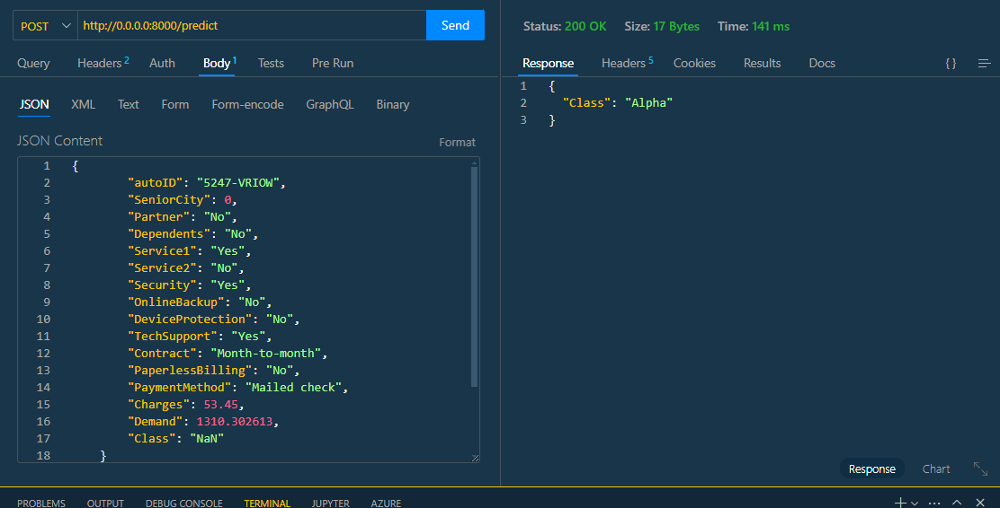

# Prueba Técnica Gestor

## Descripción del Proyecto

Este proyecto consiste en el desarrollo de un modelo de gestión para la resolución de una prueba técnica. El objetivo principal es demostrar habilidades en análisis de datos, desarrollo de notebooks y buenas prácticas de programación en Python.

El repositorio contiene notebooks que abordan diferentes etapas del proceso, desde la carga y exploración de datos hasta el desarrollo y evaluación de modelos.

## Requisitos Previos

- Python >3.11
- Git

## Estructura del Proyecto

```plaintext
PRUEBA_TECNICA_GESTOR/
├── .venv/
├── code/
│   ├── api/
│   │   ├── __pycache__/
│   │   ├── controller.py
│   │   ├── endpoints.py
│   │   └── middleware.py
│   ├── config/
│   │   ├── __pycache__/
│   │   └── config_file.py
│   ├── data/
│   │   ├── dataset_alpha_betha.csv
│   │   ├── dataset_demand_acumulate.csv
│   │   └── to_predict.csv
│   ├── models/
│   │   ├── classifier_model.joblib
│   │   └── scaler_model.joblib  
│   ├── schemas/
│   │   ├── __pycache__/
│   │   └── schema_api_prediction.py
│   ├── utils/
│   ├── classification_exercise.ipynb
│   ├── main.py
│   └── time_series_exercise.ipynb
├── devops/
│   └── Dockerfile
├── documentation/
│   ├── prediction1.png
│   ├── prediction2.png
│   └── prediction3.png
├── .gitignore
├── README.md
└── requirements.txt
```

## Instrucciones de Uso

Sigue estos pasos para ejecutar todos los notebooks del proyecto:

### 1. Clonar el repositorio

```bash
git clone https://github.com/acobosolis05/prueba_tecnica_gestor.git
cd prueba_tecnica_gestor/code
```

### 2. Crear un entorno virtual

```bash
python -m venv .venv
```

### 3. Activar el entorno virtual


```bash
.\.venv\Scripts\activate
```

### 4. Instalar las dependencias

```bash
pip install -r requirements.txt
```

### 5. Ejecución del servidor

Para ejecutar este proyecto de manera local se usa el siguiente comando en la terminal.

```bash
uvicorn main:app --host 0.0.0.0 --port 8000
```

## Ejemplo de datos de entrada


```json
{
    "autoID": "9695-TERGH",
    "SeniorCity": 0,
    "Partner": "No",
    "Dependents": "No",
    "Service1": "Yes",
    "Service2": "No",
    "Security": "Yes",
    "OnlineBackup": "No",
    "DeviceProtection": "No",
    "TechSupport": "No",
    "Contract": "Month-to-month",
    "PaperlessBilling": "Yes",
    "PaymentMethod": "Electronic check",
    "Charges": 96.05,
    "Demand": 1131.71922,
    "Class": "NaN"
}
```

## Peticiones al servicio mediante Thunder Client

A continuación se anexan las pediciones solicitadas en el numeral 4, de las instrucciones de la prueba.

- 
- 
- 

## Carpeta api

Contiene los archivos controller.py, endpoints.py, middleware.py para consumo del servicio, aplicando buenas practicas de programación y separación de responsabilidades.

## Carpeta config

Contiene el archivo config_file.py de rutas y nombres de los archivos utlizados en el modelo.

## Carpeta data

Contiene los dataset usados en la creación del modelo.

## Carpeta models

Contiene los modelos de clasificación (classifier_model.joblib) y normalización de los datos entrenados (scaler_model.joblib).

## Carpeta schemas

Contiene el archivo schemas_api_prediction.py, donde se encuentra el esquema pydantic que se usa para la validación de datos recibidos en la petición HTTP.

## Carpeta utils

Contiene el arhivo label_encodings.json que tiene el diccionario para el cambio de las variables categóricas a numéricas.

## Ejercicio de series temporales

El notebook time_series_exercise.ipynb, presenta el ejercicio de series temporales.

## Ejercicio de clasificación

El notebook classification_exercise.ipynb, presenta el ejercicio de clasificación.

## Carpeta devops

Contiene el archivo Dockerfile presenta el código para la creación de un contenedor, así la aplicación puede ser ejecutada de manera más sencilla.

## Documentos de la prueba

- data_training_output.txt: con la información de las métricas generadas durante el entrenamiendo del modelo, modelo seleccionado, cantidad de datos de entrenamiento y testeo, modelos evaluados, validación cruzada, optimización de hiperparámetros, evaluación del modelo con los datos de prueba.

- teoria_.pdf: resolución de las preguntas teorícas de la prueba.

## Contacto

Airam K. Cobo Solis  
Correo: airamcobosolis@gmail.com
